# 🔍 Corrective RAG (CRAG) com Autocorreção Contratual & Jurídica

[](LICENSE)
[](https://www.python.org)
[](https://fastapi.tiangolo.com)
[](https://ollama.com)
[](https://github.com/wganalytics)

O **PRJ-04 (Corrective RAG)** é uma implementação avançada de **Self-Reflective RAG** aplicada ao domínio de contratos e documentos jurídicos complexos. O pipeline incorpora o padrão **CRAG (Corrective Retrieval-Augmented Generation)**, introduzindo auditoria em nível de aplicação (Self-Reflection), reformulação de consultas e validação granular de afirmações pós-geração para zerar a ocorrência de alucinações.

---

## 🏗️ Arquitetura do Sistema (Premium 3x)

O diagrama abaixo detalha o fluxo de controle de estados do pipeline. Cada requisição passa por uma validação de relevância do contexto recuperado, acionando ciclos de reformulação de query (até 2 retries) e, por fim, auditando cada afirmação gerada antes de retornar o veredito ao usuário.


---

## 🧭 Fluxo de Decisões e Estados (Máquina de Estados)

O orquestrador do Corrective RAG gerencia a execução através do seguinte algoritmo estruturado:

```mermaid
sequenceDiagram
    autonumber
    actor User as Usuário / Cliente
    participant API as FastAPI / Streamlit
    participant CRAG as CorrectiveRAG Engine
    participant DB as ChromaDB (Lazy)
    participant Audit as RelevanceAuditor
    participant Ref as QueryReformulator
    participant Gen as Generator LLM
    participant Val as HallucinationValidator

    User->>API: Pergunta Jurídica ("Qual o prazo de...")
    API->>CRAG: query(question)
    
    rect rgb(20, 30, 45)
        Note over CRAG, DB: Tentativa 0 (Query Original)
        CRAG->>DB: similarity_search(k=5)
        DB-->>CRAG: Contexto Recuperado
        CRAG->>Audit: audit(question, context)
        Note over Audit: Avalia Relevância, Completude e Suporte
        Audit-->>CRAG: Score & Action ("retry" | "generate")
    end

    alt action == "retry" (Tentativa 1)
        rect rgb(45, 30, 20)
            CRAG->>Ref: expand(question)
            Ref-->>CRAG: Query Expandida (Sinônimos técnicos)
            CRAG->>DB: similarity_search(expanded_query)
            DB-->>CRAG: Novo Contexto
            CRAG->>Audit: audit(question, new_context)
            Audit-->>CRAG: Score & Action
        end
    end

    alt action == "retry" (Tentativa 2 - Final)
        rect rgb(45, 20, 20)
            CRAG->>Ref: rewrite(question)
            Ref-->>CRAG: Query Totalmente Reescrita
            CRAG->>DB: similarity_search(rewritten_query)
            DB-->>CRAG: Novo Contexto
            CRAG->>Audit: audit(question, new_context)
            Audit-->>CRAG: Score & Action
        end
    end

    alt action == "generate" OR relevance >= 0.5 (Com Contexto)
        CRAG->>Gen: invoke(prompt_template)
        Gen-->>CRAG: Resposta Técnica Elaborada
        CRAG->>Val: validate_answer(answer, context)
        Note over Val: Divide em sentenças e valida suporte literal
        Val-->>CRAG: Lista de Sentenças Validadas (has_support)
        CRAG-->>API: Resposta + Qualidade ("verified" | "uncertain") + Citações
        API-->>User: Visualização na UI (Streamlit)
    else relevance < 0.5 (Falha)
        CRAG-->>API: Recusa Segura ("Base documental insuficiente...") [quality = "fail"]
        API-->>User: Alerta de recusa na tela (Sem alucinação)
    end
```



---

## 🛠️ Tecnologias e Camadas

### 1. Ingestão Jurídica (Artigo & Parágrafo)
Diferente de splitters genéricos, o PRJ-04 adota uma estratégia de chunking personalizada para o ecossistema brasileiro de Direito, utilizando marcadores hierárquicos:
*   **Separadores de Tokenização:** `["\nArt.", "\n§", "\n\n", "\n", " "]`
*   **ChromaDB Lazy Loading:** O banco vetorial local só é instanciado em memória na primeira consulta, economizando memória em operações idle.

### 2. RelevanceAuditor (Self-Reflection)
Usa o modelo **llama3.2:3b** sob amostragem deterministicamente zerada (`temperature=0`) e saída estruturada via JSONSchema para auditar 3 dimensões de dados:
*   **Relevância (0-1):** O texto contém a cláusula exata solicitada ou apenas menções genéricas?
*   **Completude (0-1):** É possível dar uma resposta conclusiva ou faltam fragmentos?
*   **Suporte (0-1):** Há referências a diplomas legais no texto recuperado?

### 3. QueryReformulator
Quando a relevância atinge scores baixos, o motor aciona a reescrita técnica jurídica:
*   **Expand:** Adiciona termos técnicos e sinônimos contratuais (ex: de "acabar contrato" para "rescisão contratual", "distrato", "resilição").
*   **Rewrite:** Foca na raiz da dúvida e altera a estrutura frasal.

### 4. HallucinationValidator
Validador pós-geração que atua como perito judicial:
*   Quebra a resposta em sentenças usando regex adaptativo.
*   Analisa se cada afirmação individual possui suporte literal e semântico no contexto recuperado.
*   Classifica a qualidade final da resposta:
    *   **Verified:** Alta relevância do contexto (Score > 0.7) + Suporte total de afirmações (Score > 0.8).
    *   **Uncertain:** Resposta gerada com pendências ou suporte parcial.
    *   **Fail:** Falha crítica de relevância (recusa em responder para evitar alucinações).

---

## ⚡ Setup e Inicialização Local

### Requisitos Prévios
*   Python 3.10 ou superior
*   Ollama instalado localmente

### 1. Instalação de Dependências
Clone o repositório e instale as dependências:
```bash
python3 -m venv .venv
source .venv/bin/activate
pip install -r requirements.txt
```

### 2. Configuração do Ollama
Certifique-se de que o Ollama está rodando e baixe os modelos necessários:
```bash
ollama pull llama3.2:3b
ollama pull nomic-embed-text
```

### 3. Variáveis de Ambiente
Copie o template de configurações e ajuste se necessário:
```bash
cp .env.template .env
```

### 4. Executando o Servidor API (FastAPI)
Inicialize o backend do pipeline:
```bash
uvicorn src.main:app --host 0.0.0.0 --port 8000 --reload
```

---

## 🧪 Suíte de Testes TDD Hermética

O PRJ-04 possui uma suíte completa de **7 testes automatizados** baseados no framework `pytest`. A suíte é 100% hermética, executando em **0.09s** sem necessidade de infraestrutura local ativa do Ollama devido ao mock agressivo em runtime.

Para rodar os testes:
```bash
pytest tests/test_auditor.py
```

### Métricas Reais do Projeto

| Métrica | Valor Registrado | Observação |
|---------|------------------|------------|
| **Total de Arquivos** | 14 arquivos Python/Markdown | Código e documentação estruturados |
| **Linhas de Código** | 932 linhas de código | Escrito sob Clean Code e SRP |
| **Suíte de Testes** | 7 testes pytest aprovados | Cobertura hermética de estados |
| **Tempo de Execução** | 0.09 segundos | Zero travamentos ou gRPC deadlocks |
| **Gargalo Contornado** | Mocking no nível `sys.modules` | Contorna limitações de mutex gRPC no macOS |
| **Jira Backlog Epic** | `GARE-53` | Marcado como Concluído |

---

## 📜 Licença

Este projeto está licenciado sob os termos da licença MIT. Para mais detalhes, consulte o arquivo [LICENSE](LICENSE).

---

<p align="center">
Desenvolvido por wganalytics · GIULIA AI Engineering Ecosystem · 2026
</p>
