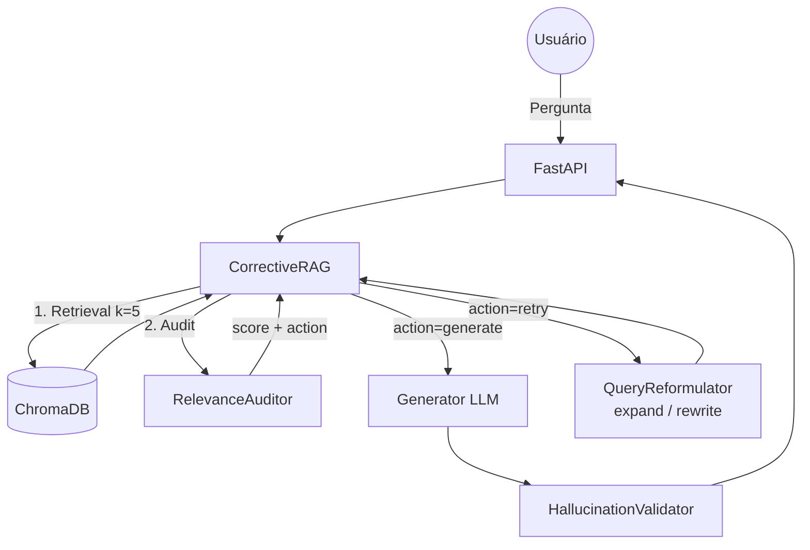

# PRJ-04_Corrective_RAG — Spec (SDD)

> **Padrão Oficial:** BMAD + SDD + TDD  
> **Última Atualização:** 2026-05-24  
> **Status:** ✅ Concluído | **Jira:** GARE-53

---

## 1. 🏗️ BMAD (Baseline Architecture)

*Pipeline CRAG: Self-Reflection + Query Reformulation + Hallucination Validation.*



---

## 2. 📝 SDD (Spec-Driven Development)

### Objetivo Principal
Pipeline RAG com **autocorreção** (CRAG). O sistema audita a relevância do contexto, reformula a query se necessário e valida a resposta contra o contexto para detectar alucinações. Domínio jurídico (chunking por `Art.` e `§`).

### Módulos Essenciais

| Módulo | Responsabilidade |
|--------|-----------------|
| `corrective_engine.py` | Orquestrador: retrieval → audit → generate/retry loop (`max_retries=2`) |
| `evaluator.py` | `RelevanceAuditor`: retorna `{relevance: float, action: "generate"/"retry"}` |
| `reformulator.py` | `expand()` (tentativa 1) e `rewrite()` (tentativa 2) |
| `validator.py` | `HallucinationValidator`: valida claims da resposta contra contexto |

### Lógica CRAG

```
Tentativa 0 → Retrieval → Audit
  NÃO relevante → Reformulator.expand() → Tentativa 1
  Relevante     → Generate → Validate → Return

Tentativa 1 → Retrieval → Audit
  NÃO relevante → Reformulator.rewrite() → Tentativa 2
  Relevante     → Generate → Validate → Return

Tentativa 2 (final):
  relevance < 0.5 → FAIL (mensagem de recusa)
  relevance ≥ 0.5 → Generate → Validate → Return
```

### Métricas de Qualidade

| Métrica | Threshold | Descrição |
|---------|-----------|-----------|
| `relevance` | ≥ 0.7 | Contexto suficiente para geração |
| `support_score` | ≥ 0.8 | Claims com suporte no contexto |
| `quality` | `verified` / `uncertain` / `fail` | Etiqueta final |

### Guardrails

- **Recusa pós-max_retries:** `relevance < 0.5` → resposta de recusa padrão sem alucinar
- **Chunking Jurídico:** separadores `["\nArt.", "\n§", "\n\n"]` preservam integridade legal
- **Lazy VectorStore:** `_get_vs()` inicializa ChromaDB apenas na 1ª query

### Fluxo de Exceções

| Cenário | Comportamento |
|---------|---------------|
| Relevância insuficiente | `quality="fail"` + mensagem de recusa |
| ChromaDB vazio | `relevance=0` → ciclo de reformulação inicia |
| PDF inválido | API retorna HTTP 422 |

---

## 3. 🧪 TDD

| Teste | Critério |
|-------|----------|
| `test_auditor_high_relevance` | `critique["action"] == "generate"` |
| `test_auditor_low_relevance` | `critique["action"] == "retry"` |
| `test_reformulator_expand` | `len(expanded) > len(original)` |
| `test_hallucination_validator` | `validation[0]["has_support"] == True` |
| `test_max_retries_fail` | `quality == "fail"` após 2 tentativas sem contexto |
| `test_quality_verified` | `quality == "verified"` com alta relevância e support |
| `test_pdf_chunking_juridico` | Chunks não cortam no meio de artigos |

**Status:** ✅ Validado. Pipeline CRAG operacional com 3 etapas de autocorreção.
